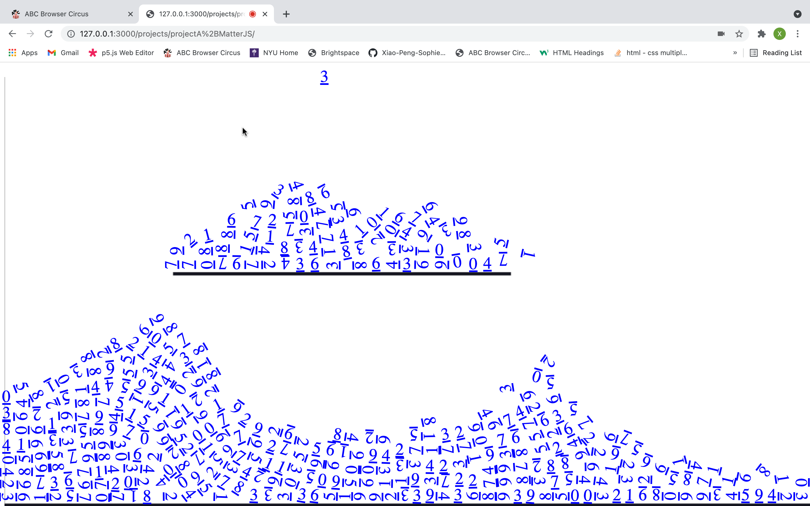

###Introduction###

This is a project about gravity. Some random numbers will fall down from the top of the screen which follow the gravity rule and users can control the movement of these numbers by tilting their laptop. And these numbers are anchored with links to different webpages about gravity. Through my project, I want to explore how  websites can cross the boundary between virtual space and the physical world.

###Challenges & Solutions###

There are two major challenges I have encountered. The first problem is to detect the tilt of the computer since the laptop doesn’t have an accelerometer, so I use [poseNet](https://ml5js.org/) to detect the eyes and calculate the tilting angle. The second one is the gravity effect and I solve this problem by using [Matter.js](https://brm.io/matter-js/), a 2D physics engine.

###Feedback###
I have received lots of feedback during the critique, such as the actual code of the website falling down from the screen, or a seemingly “normal” interface at the beginning, which I think are all interesting ideas to further develop :)

###Visit my [website](https://xiao-peng-sophie.github.io/abc-student-repo/projects/projectA+MatterJS/index.html)!###
