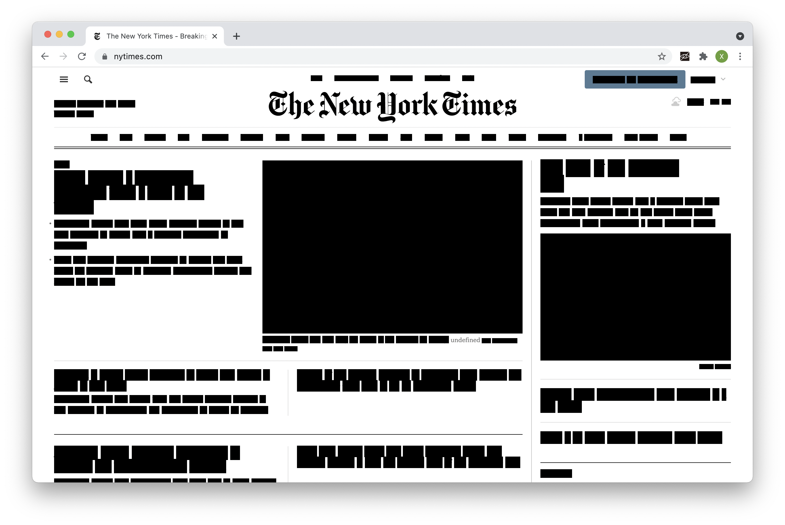

## Hearing the Web
### Introduction
You must have been used to SEEING the web pages. What if you LISTEN to them?

When we browse web pages with our eyes, we easily pick out some key words and ignore the rest. But when we have to hover the mouse over each invisible word to listen, we cannot “filter out” information anymore, which turns browsing into an exploratory experience full of surprise.

This project aims to create an unconventional browsing experience and challenge the way we perceive information.

### Process
In my project, I used the  [Chrome tts api](https://developer.chrome.com/docs/extensions/reference/tts/) for the text-to-speech effect. This API works only on the background script so I need to send the words which need to be read aloud to the background script. Another challenge for me is to split the texts on the web page into words and transform them into span tags. It is easy to break the structure of the website when splitting the texts if there are some tags inside a certain tag. Thanks for Leon’s help, this problem was solved by searching for “><” in the html code (in cases like “<a>some words</a>”.

After solving the text-reading problem, the next part is to make the web content invisible. At first, I tried to make the whole page black by changing the background color of the document body. But I found it too challenging for users to capture the content of the page since it is very difficult to control the mouse position in the same line. So I decided to turn each span tag and the image/video invisible.

Based on the feedback I have received from my peers and the guest critique, I think there are some spaces for improvement. The first one is to distinguish the concept of my project from the idea of the accessible design. Apart from that, I can explore and apply more functions inside the tts engine to create different effects.
