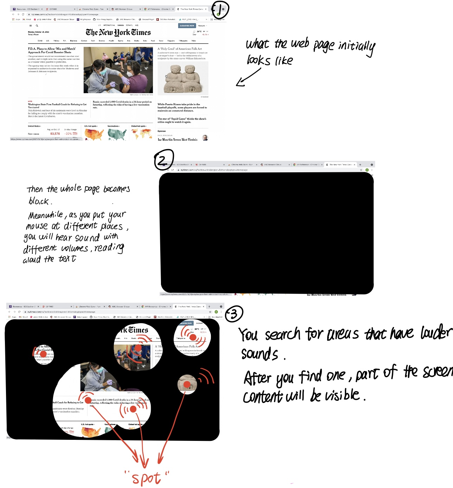

# Hearing the Web

## Description
My idea for project B is about blindness. Most of us have been used to browsing websites with our eyes. But are there other possibilities to perceive those websites? What if we need to make lots of efforts to make a web page visible?
You will start with a black page where you can see nothing about the web page. However, as you move your mouse around, you can hear a voice reading aloud the content of the webpage (at the paragraph where your mouse hover). Those sounds have different volumes and if you move your mouse towards the area with louder sounds, that part of the web page will become visible. By doing this, you will eventually make the whole page visible again as you explore different “spots”.   

## Inspiration & Concept
I’m inspired by a game where you are asked to guess the position of an object based on the volume of a signal sound and I want to create an exploratory experience using the idea of that game. Meanwhile, I also want to explore different ways to browse a website. Extension is the parasite of a browser, and I hope that my “parasite” can alter people’s browsing experiences by changing the way a website conveys its messages.
