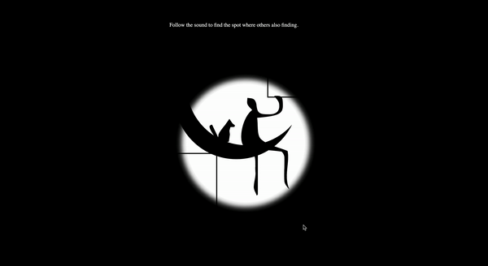
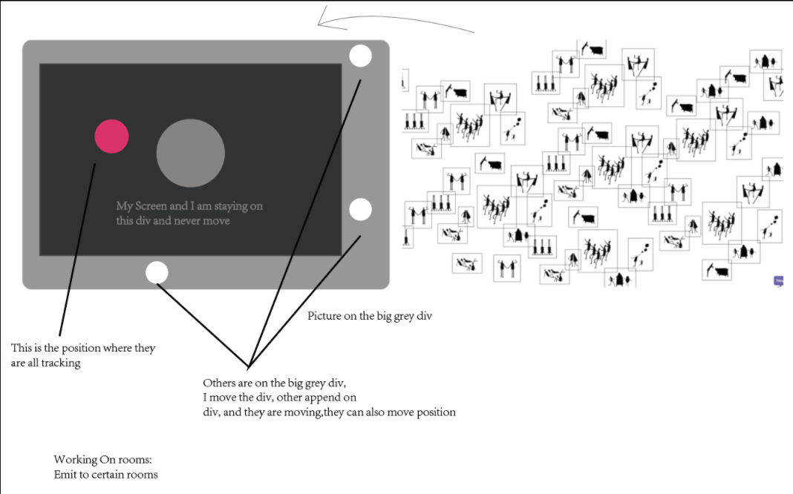

## Nice-to-SEE-you by Clover & Sophie
### Introduction
Are we becoming more intimate with each other or more alienated in the digital age? While we reflect on how the internet makes us isolated, we reimagine the website as a space to encounter and to connect. Our project aims to create an exploratory experience where multiple users follow a sound to find each other as they explore in the dark. Nice to SEE you–in the dark.

### Visit our website [here](https://nice-to-see-youu.glitch.me/)

### Technical Overview

#### Moving & Message sending
We decided to fix the position of each user’s sight (the white circle) on the center of the screen. And when the user presses the key, he/she is actually moving the big map. In terms of the message sending, each user’s position message is sent to the server when the key is pressed.

#### Sound
Since we want players to find the spot on the map by following the sound, we add some spatialization of sound on the 2D interface. We use [StereoPannerNode](https://developer.mozilla.org/en-US/docs/Web/API/StereoPannerNode) to add the left/right pan so that users can identify the direction of the sound. And when they move up and down, they will hear the changes in the volume of the sound.

#### Visual effects
For the visual effect of “seeing in the dark”, we use the black png image and put it on the top of the black div. Then we add a white div between the image and the black div so that part of the image becomes visible on the white circle. We also use z-index to adjust the layers.

### Compromises & Shortcomings
We wanted to add room functions to limit the number of players on the website and we have built a version with rooms. However, after we have added the rooms, we found that the update of position becomes very slow so we decided to give up the function for now. Apart from that, we also want to use express to take the users to a new space when they have encountered each other. Unfortunately this part remains unfinished before the presentation.

### Further improvement
We have received lots of inspiring feedback during the critique. For instance, the guest critique mentions the idea that each user has his/her own sound and (s)he can choose to emit that sound so that others can follow the sound to find him/her. And we do think that’s a very interesting idea compared with leading all the users to the same spot on the map. Also, based on the comments from our peer, we think we should finish the express part, which can take users to a different web page when they successfully find others. Last but not least, we need to spend some efforts to make the visual of the animation and the map coherent.

### Last but not least...
Special thanks to Clover, Leon and other people who help with our project and provide feedback :)
